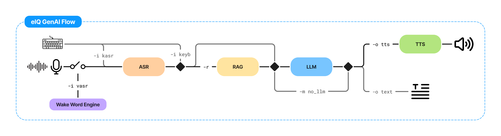
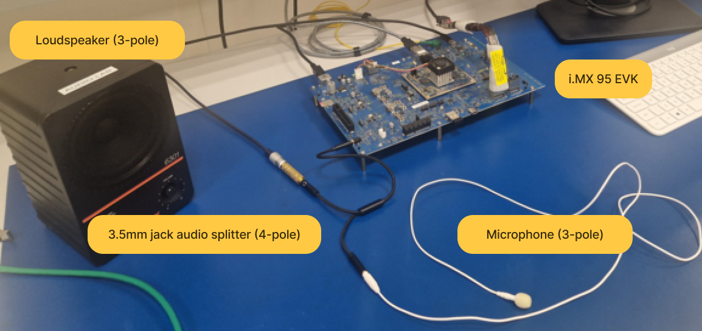

# eIQ® GenAI Flow

[](./eiq_genai_flow/LICENSE.txt)
[](https://www.nxp.com/products/i.MX95)
[](https://www.nxp.com/products/i.MX94)
[](https://www.nxp.com/products/i.MX93)
[](https://www.nxp.com/products/i.MX91)
[](https://www.nxp.com/products/I.MX8MPLUS)
[](https://www.nxp.com/products/I.MX8MMINI)
[](https://www.nxp.com/products/I.MX8MNANO)

[]()
[]()

**eIQ® GenAI Flow** is a software pipeline for AI-powered experiences on edge devices. The Flow supports **conversational AI** in English on the **NXP [i.MX9](https://www.nxp.com/products/iMX9-PROCESSORS) and [i.MX8M](https://www.nxp.com/products/i.MX8M)** applications processors.

---

## Overview

The eIQ® GenAI Flow integrates multiple AI technologies to create a seamless HMI experience. The conversational AI flow consists of the following stages:

1. **Wake-Word Detection**: A VIT (Voice Intelligent Technology) Wake-Word triggers the ASR (Automatic Speech Recognition).
2. **Speech-to-Text (ASR)**: Converts spoken input into text.
3. **Retrieval-Augmented Generation (RAG)**: Enhances the Large Language Model (LLM) with relevant external knowledge.
4. **Text Generation (LLM)**: Generates a response based on the retrieved context.
5. **Text-to-Speech (TTS)**: Converts the response into speech output.



For more details, use the [NXP Community Forum Generative AI & LLMs](https://community.nxp.com/t5/Generative-AI-LLMs/bd-p/Generative-AI-LLMs).

---

## Table of Contents

- [Platforms supported and flow configuration recommendations](#flow-configuration-recommendations)
- [Demonstrator limitations](#limitations)
- [Installation](#installation)
- [Getting Started](#getting-started)
- [Software Components](#software-components)
  - [Voice Intelligent Technology (VIT)](#voice-intelligent-technology-vit)
  - [Automatic Speech Recognition (ASR)](#automatic-speech-recognition-asr)
  - [Retrieval-Augmented Generation (RAG)](#retrieval-augmented-generation-rag)
  - [Large Language Model (LLM)](#large-language-model-llm)
  - [Text-To-Speech (TTS)](#text-to-speech-tts)
- [Using NPU Acceleration](#using-npu-acceleration)
- [Benchmark mode](#benchmark-mode)
- [Audio setup](#audio-setup)
- [GUI](#graphical-user-interface-gui)
- [Troubleshooting](#troubleshooting)
- [Release Notes](#release-notes)

# Platforms supported and flow configuration recommendations

<a name="flow-configuration-recommendations"></a>

**eIQ® GenAI Flow** can run on various i.MX platforms with different performance tiers. The following table provides configuration recommendations:


| Performance Tier     | Hardware Requirements         | i.MX SOC                  | Flow Configuration | ASR Models                     | LLM Models                                             | Additional Notes                           |
| ---------------------- | ------------------------------- | --------------------------- | -------------------- | -------------------------------- | -------------------------------------------------------- | -------------------------------------------- |
| **High Performance** | 6+ cores, 1.8+ GHz, 8+ GB RAM | i.MX95                    | Full Flow          | whisper-small, moonshine-base  | danube-500M-q8, danube-500M-q4                         | Complete pipeline with optimal performance |
| **Standard**         | 4+ cores, 1.5+ GHz, 3+ GB RAM | i.MX943, i.MX8MP | Full Flow          | moonshine-base                 | danube-500M-q8 (i.MX8M/i.MX9), danube-500M-q4* (i.MX9) | Balanced performance and features          |
| **Lightweight**      | 2+ cores, 1.5+ GHz, 2+ GB RAM | i.MX93                    | Partial Flow       | moonshine-base, moonshine-tiny | danube-500M-q4                                         | LLM enabled with smaller models            |
| **Minimal**          | 2+ cores, 1.2+ GHz, 2+ GB RAM | i.MX8MN, i.MX8MM          | Retrieval Only     | moonshine-base, moonshine-tiny | None                                                   | No LLM processing                          |
| **Ultra-Light**      | 1 core, >1.2 GHz, 2+ GB RAM   | i.MX91                    | Retrieval Only     | moonshine-tiny                 | None                                                   | No LLM, no TTS                             |

**q4 models have reduced performance on i.MX8Mx platforms with Cortex-A53 cores compared to i.MX9x Cortex-A55 architectures.*


### Configuration Details

- **Full Flow**: VIT + ASR + RAG + LLM + TTS
- **Partial Flow**: VIT + ASR + RAG + LLM + TTS (reduced model size)
- **Retrieval Only**: VIT + ASR + RAG + TTS (knowledge base queries without LLM generation, except no TTS on ultra-light tier)

See [GEN-AI-FLOW](https://www.nxp.com/applications/technologies/human-machine-interface/voice-processing/simplified-and-optimized-generative-ai-at-the-edge-with-eiq-genai-flow:GEN-AI-FLOW) for additional details and benchmarks.

---

<a name="limitations"></a>

# Demonstrator Limitations

This eIQ® GenAI Flow demonstrator has the following limitations:

- **Session timeout**: The demonstrator automatically shuts down after 1 hour of operation
- **Language support**: The demonstrator supports English language only
- **Component delivery**: ASR, LLM, and TTS components are provided as optimized binary libraries with predefined configuration options
- **Model selection**: Includes a curated subset of ASR and LLM models optimized for the target platforms
- **Model format**: Models are delivered in an encrypted format

These limitations are designed to provide an optimal evaluation experience while showcasing the capabilities of the eIQ® GenAI Flow on NXP platforms.

---

<a name="installation"></a>


## Installation from binary package

### BSP selection

This demo requires a Linux BSP available at [Embedded Linux for i.MX Applications Processors](https://www.nxp.com/design/design-center/software/embedded-software/i-mx-software/embedded-linux-for-i-mx-applications-processors:IMXLINUX).

The NPU Acceleration is available only for i.MX95 devices running the [L6.12.34-2.1.0_IMX95 BSP](https://www.nxp.com/webapp/sps/download/license.jsp?colCode=L6.12.34-2.1.0_IMX95&appType=file1&DOWNLOAD_ID=null) with a specific device tree configuration (extended CMA memory region), see [CMA Configuration](#cma-configuration).
The NPU Acceleration benefits are an important CPU load reduction plus a faster Time-To-First-Token (TTFT) on LLM operations. See LLM Benchmark section for details.

The demo will run on CPUs only on all other platforms.

### Install Git LFS

This repository uses [Git Large File Storage (LFS)](https://git-lfs.github.com/) to manage large files (e.g., models, datasets, binaries).

**Before cloning this repository**, ensure that Git LFS is installed and initialized on your host machine.

**Ubuntu / Debian:**

```bash
sudo apt update
sudo apt install git-lfs
```

**macOS (Homebrew):**

```bash
brew install git-lfs
```

**Windows:**
Download and install Git LFS from https://git-lfs.github.com/

### Initialize Git LFS (Run Once)

```bash
git lfs install
```

### Cloning the project

```bash
git clone --single-branch -b release/v2.0 https://github.com/nxp-appcodehub/dm-eiq-genai-flow-demonstrator
cd dm-eiq-genai-flow-demonstrator
```

Git LFS will automatically download all tracked large files during or after the clone. If needed, you can run:

```bash
git lfs pull
```

to manually fetch any missing LFS files.

Once fully cloned, the **eiq_genai_flow** folder from this package can be copied on the linux /root folder of the target device. Make sure to have at 16GB of free space for the demo, models and dependencies.

---

<a name="getting-started"></a>

## Getting Started

The dependencies of the demo needs to be installed on the device before first run, use the following command:

```bash
./install.sh
```

Once the dependencies are installed, to run the demo, use the following command:

```bash
python3 eiq_genai_flow.py
```


> Run ```python3 eiq_genai_flow.py --help``` to see available options.

The default mode is keyboard-to-speech, meaning the module VIT and ASR are disabled. To enable the speech-to-speech experience use the  `--input-mode vasr` argument.

The application supports various input/output options and model selections, which are detailed in the software components sections below.

---

<a name="software-components"></a>

## Software Components

<a name="voice-intelligent-technology-vit"></a>

### Voice Intelligent Technology (VIT)

VIT is NXP’s Voice UI technology that enables always-on Wake-Word detection using deep learning.

VIT is integrated with **"HEY NXP"** pre-defined Wake-Word.

**✅ Enabling VIT**

Use the `-i vasr` argument to enable ASR **after the Wake-Word detection**.

Additional options include:

- `-c` (continuous mode): Allows continuous conversation without requiring the Wake-Word after each response.

#### Custom Wake-Word Models

You can use custom wake-word models with the `-w/--wake-word-model` option:

```bash
python3 eiq_genai_flow.py -i vasr -w path/to/your/custom_model.bin
```

**Creating Custom Wake-Word Models:**

1. **Generate the model** at the [VIT Model Generation Tool](https://vit.nxp.com/#/)

   - Select **"Linux BSP"** for SW platform & version
   - Choose **"LF6.1.55_2.2.0 - LF6.6.3_1.0.0"** for Linux BSP version
   - Select any device (your choice)
   - Define your custom wake words
   - Generate and download the model package
2. **Convert the header file to binary format:**

   ```bash
   # Extract the VIT_Model_*.h file from the downloaded package
   python3 vit/scripts/convert_model.py VIT_Model_yourmodel.h VIT_Model_yourmodel.bin
   ```
3. **Use your custom model:**

   ```bash
   python3 eiq_genai_flow.py -i vasr -w VIT_Model_yourmodel.bin
   ```

**Model Requirements:**

- Only models generated with **VIT Library version 4.9** are supported
- The conversion script will validate the model version and provide guidance if incompatible

**Example with validation:**

```bash
# Validate your model before use
python3 vit/scripts/convert_model.py --validate VIT_Model_yourmodel.bin

# Use the validated model
python3 eiq_genai_flow.py -i vasr -w VIT_Model_yourmodel.bin
```

⎺⎺⎺
<a name="automatic-speech-recognition-asr"></a>

### Automatic Speech Recognition (ASR)

ASR converts spoken language into text. This project supports multiple ASR models optimized for NXP platforms.

- moonshine-tiny
- moonshine-base
- whisper-small.en


**✅ Enabling ASR**

Use the `--input-mode` argument with one of the following values:

- `-i vasr`: Enables ASR after detecting the VIT Wake-Word.
- `-i kasr`: Activates ASR via keyboard input (press "Enter" to start transcription).
- `-i keyb`: Disables ASR, using keyboard input only.
- `-i chat_interface`: Enables a chat-like example interface for interaction, if exists. See [GUI](#graphical-user-interface-gui).
- `-i <user_gui>`: Enables the user defined interface for interaction, if it inherits GuiConfig Class. See [GUI](#graphical-user-interface-gui)

To enable continuous ASR, pass the `-c` flag. In this mode, ASR remains active until a timeout occurs due to inactivity.

**⚙️ ASR API**

```python
from asr.streaming.speech_to_text import SpeechToText

asr = SpeechToText(
    model_name='whisper-small.en', #  'whisper-small.en', 'moonshine-base', etc.
    language='English',  # 'only for multilingual models: English, French, Chinese, etc.'
    task='transcribe',  # 'only for multilingual models: transcribe' or 'translate'
    source='mic',  # 'mic' or 'file',
    audio_card_name='default',  # audio card name
    stream_print=False # disable progressive text printing in the terminal
)

''' transcribe speech from a file '''
text_from_file = asr.file_to_text(audio_file='tests/data/sample_en.wav')
print(text_from_file) # final text after end of transcription

''' transcribe speech from the microphone '''
text_from_mic = ''
for text_from_mic in asr.mic_to_text():
    pass # [optional] gui.send_qst(text_from_mic) can be used to feed a GUI
print(text_from_mic)  # final text after end of transcription
```

**📊 ASR Benchmark**

Model profiling and WER evaluation are available [here](https://www.nxp.com/design/design-center/software/embedded-software/automatic-speech-recognition:ASR).

⎺⎺⎺
<a name="retrieval-augmented-generation-rag"></a>

### Retrieval-Augmented Generation (RAG)

RAG enhances the LLM’s responses by grounding the input in factual information from a knowledge base. This significantly improves the relevancy of the response to the prompt and reduces LLM hallucinations overall.

The demonstrator uses all-MiniLM-L6-v2 int8-quantized embedding model with 22M parameters.

**✅ Enabling RAG**

Use the `--use-rag` argument to activate RAG.

#### RAG Example

The pre-generated RAG database is about medical healthcare for patients with diabetes, so questions related to this topic can be asked. This RAG database example was generated using the information in [Medical.pdf](rag/src/data/input_files/Medical.pdf).

#### Generate a RAG Database

To create a RAG database, please follow the instructions of the [RAG documentation](rag/README.md).

⎺⎺⎺
<a name="large-language-model-llm"></a>

### Large Language Model (LLM)

The LLM is responsible for understanding input and generating relevant text-based responses. It predicts words based on the given input using advanced language modeling techniques.

The demonstrator uses Danube int8 or int4 quantized LLM with 500M parameters, derived from Llama LLM family.


**✅ Enabling LLM**

LLM is enabled by default and requires no additional parameters.
Answers given by the LLM have a maximum number of words, if this number is reached, it will print "[...]".

**⚙️ LLM API**

```python
from llm.modeling_llm import make_LLM
from llm.config.user_config import Config as user_config

llm = make_LLM(name="danube-500M-q8",  # LLM model
               user_params=user_config # user-defined configuration
               )

while True:
    question = input("\nType your question here: ")
    for i, token in enumerate(llm(question, user_config.prompt)):
        print(token, end="")
```

**📊 LLM Benchmarks**

Expected performances of the LLMs inside the demo can be found at: [eIQ GenAI Flow Page](https://www.nxp.com/applications/technologies/human-machine-interface/voice-processing/simplified-and-optimized-generative-ai-at-the-edge-with-eiq-genai-flow:GEN-AI-FLOW)

⎺⎺⎺
<a name="text-to-speech-tts"></a>

### Text-To-Speech (TTS)

TTS converts the LLM-generated text responses into speech output.

The demonstrator uses a Vits int8-quantized model with 19.5M parameters.

**✅ Enabling TTS**

Use the `--output-mode tts` argument to enable TTS, or `--output-mode text` to disable it.

**⚙️ TTS API**

```python
from tts.inference import TTSPlayer
from tts.config import MultiSpeakerTTS16kHzConfig, MultiSpeakerTTS16kHzQuantConfig

# you can choose between the normal or quantized model (the latter is faster)
# config = MultiSpeakerTTS16kHzConfig(
config = MultiSpeakerTTS16kHzQuantConfig(
  speaker_id=1,  # between 1 and 900
  speed=0.52  # the greater, the faster
)
# it will generate speech and play it
tts = TTSPlayer(config)
# whole text
tts("Hello world!", eos=True)
tts.join()  # wait until generation & audio playback are finished
# token by token
for token in ["This", " is", " a", " sentence", ".", " Another", " one", "."]:
  tts(token)
tts(eos=True)
tts.join()  # wait until generation & audio playback are finished
```

**📊 TTS Benchmark**

Model profiling and speech quality measurement (DNS-MOS) are available [here](https://www.nxp.com/design/design-center/software/embedded-software/text-to-speech:TTS).

---

<a name="using-npu-acceleration"></a>

## Using NPU Acceleration

NPU acceleration can be used for LLM inference on `i.MX 95`. It requires the BSP to have an extended CMA (> 4GB) for Neutron NPU. This CMA is defined via the linux device tree, ensure to have such a dtb set as fdtfile in uboot.
To enable NPU acceleration, pass the `--use-neutron` flag when running the pipeline on supported BSPs.

---

<a name="benchmark-mode"></a>

## Benchmark Mode

The eIQ® GenAI Flow includes a benchmark mode for performance evaluation and testing any configuration of the flow.
It converts the `tests/data/questions.txt` file to wav files if necessary to feed the pipeline and collect performance metrics. The [questions.txt](tests/data/questions.txt) can be customized to match the RAG database for instance. Results are given as a json report (metrics only) and a log file (detailed traces from each pipeline stage).
This mode allows to measure key average metrics per request such as:

- **TTFA Avg**: Time To First Audio (seconds), the lower the better
- **Time Avg**: Total pipeline processing time (seconds), the lower the better
- **CPU Avg**: Average CPU utilization (%), the lower the better
- **Memory Avg**: Average memory usage (MB)
- **ASR Avg Time**: ASR processing time (seconds), the lower the better
- **RAG Avg Time**: RAG processing time (seconds), the lower the better
- **LLM Avg Time**: LLM processing time (seconds), the lower the better
- **TTS Avg Time**: TTS processing time (seconds), the lower the better
- **ASR WER**: Automatic Speech Recognition Word Error Rate (%), the lower the better
- **LLM TTFT**: Large Language Model Time To First Token (seconds), the lower the better
- **LLM TPS**: Large Language Model Tokens Per Second, the higher the better
- **TTS RTF**: Text-To-Speech Real Time Factor, the lower the better

To run benchmark mode:

```bash
python3 eiq_genai_flow.py -i vasr -r -b # usual configuration + '-b'
```

Various configurations have been benchmarked, results are available in [eIQ GenAI Flow Page](https://www.nxp.com/applications/technologies/human-machine-interface/voice-processing/simplified-and-optimized-generative-ai-at-the-edge-with-eiq-genai-flow:GEN-AI-FLOW).

---

<a name="audio-setup"></a>

## Audio setup

The demo's default audio setup is based on the on-board [WM8962 codec](https://community.nxp.com/pwmxy87654/attachments/pwmxy87654/imx-processors/58279/1/WM8962_v4.2.pdf) present on most EVK's, which manages both input and output through a single 3.5mm jack connector CTIA.

However, USB devices for capture/playback can be used with some precautions, see below.

### WM896* codec

This codec is the one chosen by default when the `--capture-device` and `--playback-device` parameters are not given.

To use the audio functionalities, the following setups are possible:

- **🎧 Headset Mode:** Use a headset with an integrated microphone and a 4-pole CTIA connector.
- **🔊 Open Audio Setup:** Use a **3.5mm jack audio splitter** (4-pole CTIA) along with:
  - 🎤 A standalone **microphone** (3-pole)
  - 🔉 A **loudspeaker**

Setup example:



This ensures proper handling of both input and output audio during the demo.

Some settings defined in the shared_utils/audio_config.sh such as the capture level and playback level are automatically applied on startup, and can be customized in this shell script.

Note that if this codec is not present on the platform, a fall-back to another device will be done, as displayed while passing the `-h` to the project.

### USB devices/codecs

Running the demo with `-h` will display the audio interfaces found on the system, and selectable via the `--capture-device` and `--playback-device` parameters.

The displayed interfaces use ALSA's "plughw" format, which automatically converts audio formats to match your hardware requirements.

**Important Notes:**

- All audio devices found by the BSP will be listed, however not all devices may be compatible with the required audio format
- Audio devices must support FLOAT_LE format, 2 channels, 16kHz (the ALSA plug plugin handles format conversion automatically)
- For any audio issues, see the [Troubleshooting](#troubleshooting) section

**Customization:**
The audio settings (volume, etc..) can be customized by editing the [audio_config.sh](shared_utils/audio_config.sh) script, which can automatically applies a custom configuration when the demo starts.

⎺⎺⎺
<a name="graphical-user-interface-gui"></a>

### Graphical User Interface (GUI)

The eIQ® GenAI Flow automatically searches for python apps which inherits the GuiConfig class, and placed in gui/modules. The GUIs discovered are listed in the input configurations (`-i`).
The eIQ® GenAI Flow includes a chat interface example for interactive conversations with visual feedback.

The GUI runs as a separate process and communicates through message queues for responsive interaction during AI processing.

**🚀 Quick Launch**

A launcher script is provided to initialize the GUI and eIQ® GenAI Flow with a customizable configuration:

```bash
cd gui/modules/chat_interface
pip install -e . # To run once
./launch_gui.sh # script to customize with paths/configuration
```

**💬 Features**

- Real-time chat bubbles for questions and responses
- Visual status indicators for connection and listening states
- Streaming AI responses as they generate

---

<a name="troubleshooting"></a>

## Troubleshooting

### Audio Issues

eIQ® GenAI Flow opens the audio devices in FLOAT_LE format, 2 channels, 16kHz. It uses the Alsa plug plugin to make relevant format conversions.
If you're experiencing audio problems with the eIQ® GenAI Flow, use the following commands to diagnose and test your audio setup:

```bash
# List available audio devices
arecord -l  # Input devices
aplay -l    # Output devices

# Test audio recording and playback
arecord -D plughw:CARD=CAPTURE_DEVICE -d 10 -r 16000 -c 2 -f FLOAT_LE > out.pcm
aplay -D plughw:CARD=PLAYBACK_DEVICE -d 10 -r 16000 -c 2 -f FLOAT_LE out.pcm
```

*Note: Replace "CAPTURE_DEVICE" and "PLAYBACK_DEVICE" with the actual device names returned by `aplay -l` and `arecord -l` commands.*

**Common Audio Issues:**

- **No audio devices found**: Ensure your audio hardware is properly connected and recognized by the system
- **Permission denied**: You may need to add your user to the `audio` group: `sudo usermod -a -G audio $USER`
- **Device busy**: Another application might be using the audio device. Close other audio applications or restart the system
- **Poor audio quality**: Check cable connections and ensure you're using the correct audio format settings
- **No Audio**: Your device, plug plugin or BSP may not be compatible with eIQ® GenAI Flow audio configuration

For USB audio devices, refer to the [Audio setup](#audio-setup) section for additional configuration guidance.

### NPU Issues

Neutron NPU acceleration for LLM is only available on i.MX95 B0, on compatible BSP versions with compatible ONNXruntime library installed and extended CMA. Diagnostics and troubleshooting steps:

<a name="cma-configuration"></a>

#### CMA configuration

```bash
# Check CMA memory allocation:
cat /proc/meminfo | grep CMA
```

It must be > 4GB.

If not, the Neutron device tree blob (DTB) must be set manually in U-Boot.
To set the correct DTB neutron in u-boot:

* Stop the boot at u-boot stage (press a key)
* List and identify the available Neutron DTB files. If flashed on an SD card, use:
  ```
  u-boot=> fatls mmc 1:1
  ```
* Set a Neutron-enabled DTB, for example:

```bash
u-boot=> setenv fdtfile imx95-19x19-evk-neutron.dtb
u-boot=> saveenv
u-boot=> boot
```

If no neutron dtb are available, build your own from the Linux kernel: Append imx95-15x15-evk-neutron.dtbo or imx95-19x19-evk-neutron.dtbo to your current dtb in `arch/arm64/boot/dts/freescale/Makefile`, and build it.
For instance:

```
imx95-15x15-frdm-neutron-dtbs := imx95-15x15-frdm.dtb imx95-15x15-evk-neutron.dtbo
dtb-$(CONFIG_ARCH_MXC) += imx95-15x15-frdm-neutron.dtb
```

#### ONNX runtime Issues

The ONNX runtime version to use is the one delivered in the BSP. Any `pip install onnxruntime=="a different version"` would force the project to use a version non-compatible with Neutron.

---
<a name="release-notes"></a>
## Release Notes
| Version | Description / Update                     | Date                         |
|---------|------------------------------------------|------------------------------|
| 1.0     | Initial release on Application Code Hub for i.MX95. This is solely for evaluation and development in combination with an NXP Product. | March 31<sup>th</sup> 2025 |
| 1.1     | Add i.MX8MP Support. This is solely for evaluation and development in combination with an NXP Product. | June 20<sup>th</sup> 2025 |
| 2.0     | **Component release:** Pipeline and RAG as Python files, other components (ASR, LLM, TTS) as binary libs. **Platform support:** i.MX9x and i.MX8Mx. **Key features:** Neutron acceleration (i.MX95 B0), customizable VIT Wake-Word, flexible audio devices, 900+ TTS voices, WhatsApp-style GUI. **Models:** moonshine-tiny/base/whisper-small.en (ASR), Danube-500M q4/q8 (LLM), all-MiniLM-L6-v2 (embedding), vits-english (TTS). **Limitation:** 60-minute timeout. This is solely for evaluation and development in combination with an NXP Product.| November 21<sup>th</sup> 2025 |


---

<br>
<p align="center">
  <a href="https://www.nxp.com">
    
  </a>
</p>
