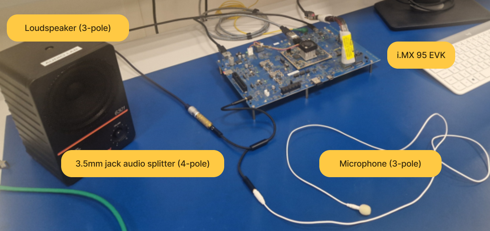

# eIQ GenAI Flow Demonstrator

[](./eiq_genai_flow/LICENSE.txt)
[](https://www.nxp.com/products/iMX95)
[]()
[]()

**eIQ GenAI Flow** is a software pipeline for AI-powered experiences on edge devices. Currently, the Flow supports **conversational AI** on the **NXP i.MX 95**. 

---
## Overview

The eIQ GenAI Flow integrates multiple AI technologies to create a seamless HMI experience. The conversational AI flow consists of the following stages: 

1. **Wake-Word Detection**: A VIT (Voice Intelligent Technology) Wake-Word triggers the ASR (Automatic Speech Recognition).
2. **Speech-to-Text (ASR)**: Converts spoken input into text.
3. **Retrieval-Augmented Generation (RAG)**: Enhances the Large Language Model (LLM) with relevant external knowledge.
4. **Text Generation (LLM)**: Generates a response based on the retrieved context.
5. **Text-to-Speech (TTS)**: Converts the response into speech output.


This demonstrator showcases some of eIQ GenAI Flow core capabilities. This English demo is designed to provide an overview of what the project can achieve and how it works.
It's a subset of the full project: **eIQ GenAI Flow Pro**.
 

The complete version of the Flow offers more options for **models**, **features**, **customization**, **RAG fine-tuning** and **better performance** on audio tasks. 

For more details, use the [NXP Community Forum Generative AI & LLMs](https://community.nxp.com/t5/Generative-AI-LLMs/bd-p/Generative-AI-LLMs).

---
## Table of Contents

1. [Pre-requisites](#pre-requisites)
2. [Installation](#installation)
3. [Getting Started](#getting-started)
4. [Software Components](#software-components)
   1. [Voice Intelligent Technology (VIT)](#voice-intelligent-technology-vit)
   2. [Automatic Speech Recognition (ASR)](#automatic-speech-recognition-asr)
   3. [Retrieval-Augmented Generation (RAG)](#retrieval-augmented-generation-rag)
   4. [Large Language Model (LLM)](#large-language-model-llm)
   5. [Text-To-Speech (TTS)](#text-to-speech-tts)
5. [Using NPU Acceleration](#using-npu-acceleration)
6. [Hardware](#hardware)
7. [Examples](#examples)
8. [FAQs](#faqs)
9. [Support](#support)
10. [Release Notes](#release-notes)


<a name="pre-requisites"></a>
## Pre-requisites

This repository uses [Git Large File Storage (LFS)](https://git-lfs.github.com/) to manage large files (e.g., models, datasets, binaries).

**Before cloning this repository**, ensure that Git LFS is installed and initialized on your machine.

### Install Git LFS

**Ubuntu / Debian:**
```bash
sudo apt update
sudo apt install git-lfs
```

**macOS (Homebrew):**
```bash
brew install git-lfs
```

**Windows:**
Download and install Git LFS from https://git-lfs.github.com/

### Initialize Git LFS (Run Once)
```bash
git lfs install
```

### Cloning the project
```bash
git clone https://github.com/nxp-appcodehub/dm-eiq-genai-flow-demonstrator
cd dm-eiq-genai-flow-demonstrator
```

Git LFS will automatically download all tracked large files during or after the clone. If needed, you can run:
```bash
git lfs pull
```
to manually fetch any missing LFS files.

### BSP selection
This demo requires a Linux BSP available at [Embedded Linux for i.MX Applications Processors](https://www.nxp.com/design/design-center/software/embedded-software/i-mx-software/embedded-linux-for-i-mx-applications-processors:IMXLINUX).

Although the demo can work on the regular NXP Q1 2025 BSP, it works best on the BSP customized with the [meta-eiq-genai-flow](meta-eiq-genai-flow) available in the package. This meta-layer updates:
* **Linux kernel:** matmul Neutron C-API
* **Device tree:** dedicated Continuous Memory Allocation (CMA) area for Neutron
* **Onnxruntime:** add Neutron Execution Provider
* **Neutron assets:** driver and firmware for matmul operations handling.
 
See [README](meta-eiq-genai-flow/README) in [meta-eiq-genai-flow](meta-eiq-genai-flow) for build details.
 
This customization benefits are an important CPU load reduction plus a faster Time-To-First-Token (TTFT) on LLM operations. See LLM Benchmark section for details.

Once the BSP is flashed on the target, the **eiq_genai_flow** folder from this package must be copied on the linux home folder.

---

<a name="installation"></a>
## Installation

To set up the environment, run:

```bash
cd eiq_genai_flow
./install.sh
```

---

<a name="getting-started"></a>
## Getting Started

To run the demo, use the following command:

```bash
./eiq_genai_flow
```

> **Note:** The binary file must always be executed from the `eiq_genai_flow` directory.
> 
> **Note**: The trial period has a timeout of 2 hours.
> 
> **Note:**  Cache is currently not enabled in i.MX 95. Every time this application is executed, the warm up time is required (less than a minute).
> 
> Run ```./eiq_genai_flow --help``` to see available options.

The default mode is keyboard-to-speech, meaning the module VIT and ASR are disabled. To enable the speech-to-speech experience use the  `--input-mode vasr` argument.

The application supports various input/output options and model selections, which are detailed in the software components sections below.

---

<a name="software-components"></a>
## Software Components

<a name="voice-intelligent-technology-vit"></a>
### Voice Intelligent Technology (VIT)

VIT is NXP’s Voice UI technology that enables always-on Wake-Word detection using deep learning.

VIT is integrated with **"HEY NXP"** pre-defined Wake-Word.

**✅ Enabling VIT**

Use the `-i vasr` argument to enable ASR **after the Wake-Word detection**.

Additional options include:

- `-c` (continuous mode): Allows continuous conversation without requiring the Wake-Word after each response.

⎺⎺⎺
<a name="automatic-speech-recognition-asr"></a>
### Automatic Speech Recognition (ASR)

ASR converts spoken language into text.

The demonstrator uses Whisper-small.en int8-quantized optimized for streaming with 244M parameters.

**✅ Enabling ASR**

Use the `--input-mode` argument with one of the following values:

- `-i vasr`: Enables ASR after detecting the VIT Wake-Word.
- `-i kasr`: Activates ASR via keyboard input (press "Enter" to start transcription).
- `-i keyb`: Disables ASR, using keyboard input only.

To enable continuous ASR, pass the `-c` flag. In this mode, ASR remains active until the user says "stop" or a timeout occurs due to inactivity.


**📊 ASR Benchmarks**

| Audio Duration | Transcription Time <br/>(after end of speech) | 
|:--------------:|:---------------------------------------------:|
|       3s       |                     1.4s                      | 	  
|       6s       |                     2.5s                      |  
|       9s       |                     3.3s                      | 

On LibriSpeech test-clean, in streaming, Word Error Rate (WER) = 4.1.

⎺⎺⎺
<a name="retrieval-augmented-generation-rag"></a>
### Retrieval-Augmented Generation (RAG)

RAG enhances the LLM’s responses by grounding the input in factual information from a knowledge base. This significantly improves the relevancy of the response to the prompt and reduces LLM hallucinations overall.

The demonstrator uses all-MiniLM-L6-v2 int8-quantized embedding model with 22M parameters.

**✅ Enabling RAG**
 
Use the `--use-rag` argument to activate RAG.

> **Note:** Some words are censored by our RAG, meaning the system will not respond if they appear in the query. The censored word list can be found in the [utils.py](retrieval-database-generator/src/rag/utils.py) file.


#### RAG Example
 
The pre-generated RAG database is about medical healthcare for patients with diabetes, so questions related to this topic can be asked. This RAG database example was generated using the information in the [Medical.pdf](retrieval-database-generator/src/data/input_files/Medical.pdf) file ([original file](https://www.hse.ie/eng/about/who/cspd/ncps/paediatrics-neonatology/resources/paediatric-type-1-diabetes-resource-pack.pdf#page=6)).

#### Generate a RAG Database
 
To create a RAG database, please follow the instructions of the [Retrieval Database Generator](retrieval-database-generator).

⎺⎺⎺
<a name="large-language-model-llm"></a>
### Large Language Model (LLM)

The LLM is responsible for understanding input and generating relevant text-based responses. It predicts words based on the given input using advanced language modeling techniques.

The demonstrator uses Danube int8-quantized LLM with 500M parameters, derived from Llama LLM family. 

**✅ Enabling LLM**

LLM is enabled by default and requires no additional parameters. 
Answers given by the LLM have a maximum number of words, if this number is reached, it will print "[...]".


**📊 LLM Benchmarks**

Expected performances of the Danube-INT8 model :

| Platform |   Accelerator   | Time-To-First-Token (TTFT) | Tok/s |               Command               |
|:--------:|:---------------:|:--------------------------:|:-----:|:-----------------------------------:|
|  i.MX95  | CPU (6 threads) |           0.94s            | 9.38  |   `./eiq_genai_flow -b`             |
|  i.MX95  |  NPU (Neutron)  |           0.59s            | 9.72  | `./eiq_genai_flow -b --use_neutron` |

Wikitext-2 perplexity of this model is 17.69 compared to the float reference at 14.76.

⎺⎺⎺
<a name="text-to-speech-tts"></a>
### Text-To-Speech (TTS)

TTS converts the LLM-generated text responses into speech output.

The demonstrator uses a Vits int8-quantized model with 19.5M parameters.

**✅ Enabling TTS**

Use the `--output-mode tts` argument to enable TTS, or `--output-mode text` to disable it.

**📊 TTS Benchmarks**

|          Speech type           |   DNS-MOS   | 
|:------------------------------:|:-----------:|
|      Reference (natural)       |    4.39     | 
|      Quantized Vits 16kHz      | 4.23 ± 0.24 |

TTS Real-Time-Factor (RTF) is ~0.24 for the given model.

---
<a name="using-npu-acceleration"></a>
## Using NPU Acceleration

On custom BSPs, NPU acceleration can be used for LLM inference. Contact support for details on enabling this feature.

To enable NPU acceleration, pass the `--use-neutron` flag when running the pipeline on supported BSPs.

---

<a name="hardware"></a>
## Hardware

To run the `eIQ GenAI Flow`, an [i.MX95](https://www.nxp.com/products/iMX95) EVK (either 19x19 or 15x15) is required. The demo's audio setup is based on the onboard [WM8962 codec](https://community.nxp.com/pwmxy87654/attachments/pwmxy87654/imx-processors/58279/1/WM8962_v4.2.pdf), which manages both input and output through a single 3.5mm jack connector CTIA.  

To use the audio functionalities, the following setups are possible:  

- **🎧 Headset Mode:** Use a headset with an integrated microphone and a 4-pole CTIA connector.  
- **🔊 Open Audio Setup:** Use a **3.5mm jack audio splitter** (4-pole CTIA) along with:  
  - 🎤 A standalone **microphone** (3-pole)  
  - 🔉 A **loudspeaker**

Setup example:



This ensures proper handling of both input and output audio during the demo.

---

<a name="examples"></a>
## Examples

When eIQ GenAI Flow Demonstrator starts running, the terminal should look like:

|            **Default mode:** <br> `./eiq_genai_flow` <br>              |        **With RAG:** <br> `./eiq_genai_flow --use-rag` <br>          |
|:--------------------------------------------------------------------------------------------------------------------------:|:----------------------------------------------------------------------------------------------------------------:|
| **With NPU acceleration:** <br> `./eiq_genai_flow --use-neutron` <br>  | **With Wake Word detection:** <br>`./eiq_genai_flow -i vasr` <br>  |


---
<a name="faqs"></a>
## FAQs

**How to change the RAG database?**

RAG database can be created from textual files. Please check the retrieval-database-generator [README.md](retrieval-database-generator/README.md).

**How to run another LLM?**

Danube-500M model is the only LLM enabled in this release version, but many other LLMs are supported in the Pro version.

**How to change the ASR model?**

In the Pro version, more ASR models are supported, including Whisper in different sizes with various languages.

**How to change the TTS voice?**

In the Pro version, a far broader and richer audio experience with hundreds of voices is proposed.

**FileNotFoundError: [Errno 2] No such file or directory: 'asr' error**

The demonstrator binary file must be executed from the eiq_gen_ai_flow directory.

---

<a name="support"></a>
## Support

For more general technical questions, use the [NXP Community Forum Generative AI & LLMs](https://community.nxp.com/t5/Generative-AI-LLMs/bd-p/Generative-AI-LLMs).

---
<a name="release-notes"></a>
## Release Notes

<table>
  <tr>
    <th>Version</th>
    <th>Description / Update</th>
    <th>Date</th>
  </tr>
  <tr>
    <td>1.0</td>
    <td>Initial release on Application Code Hub.<br> This is solely for evaluation and development<br>in combination with an NXP Product.</td>
    <td>March 31<sup>th</sup> 2025</td>
  </tr>
</table>

<br>
<p align="center">
  <a href="https://www.nxp.com">
    
  </a>
</p>
