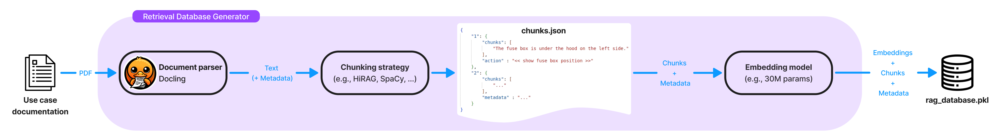

# Retrieval Database Generator

[](./LICENSE.txt)
[](https://www.nxp.com/products/iMX95)


<div style="text-align: justify;">

The **Retrieval Database Generator** is a pipeline designed to generate and test a RAG database compatible with the **eIQ GenAI Flow** application for **NXP i.MX95** devices.
</div>

---
## Overview
<div style="text-align: justify;">

**Retrieval-Augmented Generation (RAG)** enhances the knowledge base of a Large Language Model (LLM) for a target domain, device, or context. RAG helps control the LLM’s behavior, mitigate hallucinations and customize responses based on examples. RAG involves injecting additional contextual information into the input prompt of the LLM, retrieved from a compact knowledge database stored on the edge device. 

1. **Database Generation**: A knowledge database is created offline, consisting of pairs of chunks (pieces of text) and their corresponding embeddings (vectorial representations from an embedding model).
2. **Retrieval**: Each query is encoded into an embedding using the same model. The query embedding is then compared to the database embeddings and the most similar to the query are added to the prompt.
3. **Generation**: A LLM receives the formated prompt and generates an answer.
</div>

---
## Features

### Database generator
* 📚 Advanced PDF document parsing leveraging [Docling](https://github.com/DS4SD/docling "Go to Docling repository").
* ✂️ Solutions to break down large textual data using chunking algorithms. Including [HiRAG](https://openreview.net/forum?id=cWWb9cgSVi "HiRAG paper") that offers an advanced chunk reformatting.
* 🧩 Embedding model adapted for NXP platforms to generate RAG databases.

### Inference
* 🔍 A retrieval engine that finds the most relevant chunks for a given query.
---

## Table of Contents

1. [Installation](#installation)
2. [Custom Database Generation](#custom-database-generation)

   1. [(Optional) Parse PDF files](#0-optional-parse-pdf-files)
   2. [Generate Chunks](#1-generate-chunks)
   3. [Generate RAG Database](#2-generate-rag-database)

3. [Custom Database Testing](#custom-database-testing)
4. [Support](#support)
5. [Release Notes](#release-notes)

---
<a name="installation"></a>
## Installation

Install Runtime & Development Dependencies (Dev):
```bash
./install.sh
```
> Works on Linux environment. This package has been tested thoroughly with [Python 3.11.5](https://www.python.org/downloads/).

<a name="optional-setting-up-a-hugging-face-environment-"></a>
#### (Optional) Setting Up a Hugging Face Environment: 

1️⃣ [Create a Hugging Face account](https://huggingface.co/join).<br>
2️⃣ [Generate a personal read access token](https://huggingface.co/settings/tokens).<br>
3️⃣ [Log in to Hugging Face Hub](https://huggingface.co/docs/huggingface_hub/en/guides/cli):
   ```bash
   # Replace $HF_TOKEN with the generated personal access token
   huggingface-cli login --token $HF_TOKEN  
   ```

---

<a name="custom-database-generation"></a>
## Custom Database Generation

These are the steps for creating a RAG database.

💡 To understand the workflow and its features, example files in the [data folder](src/data) are included. These files illustrate the entire process, from [parsing](src/data/parsed_files) and [chunking](src/data/chunked_files) the [Medical.pdf](src/data/input_files/Medical.pdf) to incorporating handcrafted chunks. The resulting database is then used in the `eIQ GenAI Flow Demonstrator`.

<a name="0-optional-parse-pdf-files"></a>
### 0. (Optional) Parse PDF Files

To parse PDFs into Markdown files, install [Docling](https://github.com/docling-project/docling/tree/main):
```bash
pip install docling==2.14.0
```

> **Note:** [Set up a Hugging Face environment](#optional-setting-up-a-hugging-face-environment-) may be needed before running Docling.
> 
> If any issues occur, please refer to the [Docling documentation](https://docling-project.github.io/docling/).

📂 **Where to Place PDF files**

Move the PDF files into the `input_files` folder:
```
.
├── assets
├── install.sh
├── LICENSE.txt
├── pyproject.toml
├── README.md
└── src
    ├── data
    │    ├── chunked_files
    │    ├── input_files
    │    │        └── 📄 <<< PUT PDF FILES HERE >>>
    │    ├── parsed_files
    │    └── rag_database.pkl
    ├── document_parsing
    └── rag
```

To process PDFs and extract text, run:
```bash
python -m document_parsing
```
> ⚠️ **images & tables are not yet supported**
>
> Use the `--help` flag to see available options for `document_parsing`.

<a name="1-generate-chunks"></a>
### 1. Generate Chunks

To generate text chunks from Markdown files: 
```bash
python -m rag.preprocessing.generate_chunks
```
> Use the ``--help`` flag to see available options for `generate_chunks`.

> By default, the system uses the [HiRAG](https://openreview.net/forum?id=cWWb9cgSVi "HiRAG paper") chunking method, which requires running an LLM. 
> 
> To use **HiRAG**, ensure that:
>
> ✅ Access to [Meta-Llama-3-8B-Instruct](https://huggingface.co/meta-llama/Meta-Llama-3-8B-Instruct) was requested.<br>
> ✅ [A Hugging Face environment is set up](#optional-setting-up-a-hugging-face-environment-).<br>
> ✅ A **GPU with sufficient memory** (e.g., **NVIDIA RTX 3090**) is available to support 8B model inference.


📌 **Adding Custom Chunks**

Chunk files that respect this JSON format, can manually be added to [chunked_files](src/data/chunked_files):
```json
{
    "id": {                 <--- A unique identifier (mandatory)
        "chunks": [],       <--- A list of text chunks (mandatory) 
        "metadata": "...",  <--- Additional metadata (optional) 
        ...                 <--- Other optional metadata fields
    },
    ...                     <--- Other dict of chunks and metadata
}
```
An example can be found in [Medical_hand_made_chunks.json](src/data/chunked_files/Medical_hand_made_chunks.json).

🚨 **Dealing with undesirable questions and prompts**

If a chunk file named garbage_model.json is included, such as [this one](src/data/chunked_files/garbage_model.json), its chunks will be treated as part of a **garbage model**. These chunks will be retrieved but **won't be passed to the LLM** but will instead follow an out-of-domain answer procedure, which helps deal with bad inputs. 

❌ **Dealing with censored words**

Some words are **censored** by our RAG, meaning the RAG **won't retrieve any chunk** if they appear in the query. The censored word list can be found in the [utils.py](./src/rag/utils.py) file.

<a name="2-generate-rag-database"></a>
### 2. Generate RAG Database

To compute the embeddings and generate the database: 
```bash
python -m rag.preprocessing.generate_embeddings
```

> Use the `--help` flag to see available options for `generate_embeddings`.

---

<a name="custom-database-testing"></a>
## Custom Database Testing

To test the retrieval process, which identifies the most relevant chunks in the `rag_database.pkl` file, run:
```bash
python -m rag -v
```
> Use the `--help` flag to see available options for `rag`.
> 
> **Note:** Some words are censored by our RAG, meaning the system will not respond if they appear in the query. The censored word list can be found in the [utils.py](src/rag/utils.py) file.

---

<a name="support"></a>
## Support

For more general technical questions, use the [NXP Community Forum](https://community.nxp.com/).

---
<a name="release-notes"></a>
## Release Notes
| Version | Description / Update                     | Date                       |
|---------|------------------------------------------|----------------------------|
| 1.0     | Initial release on Application Code Hub. | March 31<sup>th</sup> 2025 |

<br>
<p align="center">
  <a href="https://www.nxp.com">
    
  </a>
</p>